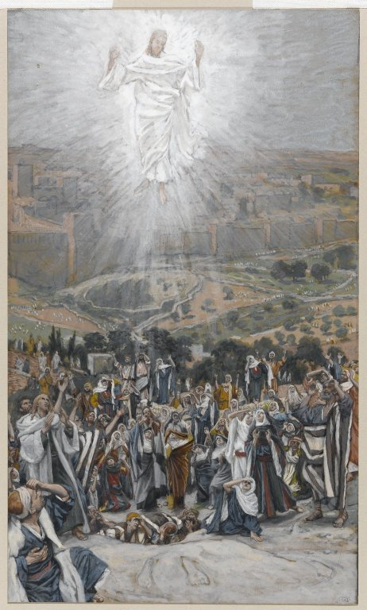

# The Second Glorious Mystery

The Second Glorious Mystery is the Ascension.  

*Mark 16:19*
> And the Lord Jesus, after he had spoken to them, was taken up into heaven, and sitteth on the right hand of God.

Fruit of the mystery: **Hope**

*James Tissot. The Ascension (L'Ascension), 1886–1894.*
