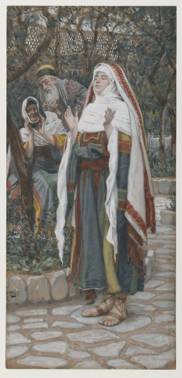

# The Fifth Glorious Mystery

The Fifth Glorious Mystery is the Coronation of Mary.

*Revelation 12:1* [^1]
> And a great sign appeared in heaven: A woman clothed with the sun, and the moon under her feet, and on her head a crown of twelve stars:  

Fruit of the Mystery: **Grace of a happy death**

  

*James Tissot. The Magnificat (Le magnificat), 1886–1894.*

[^1]: In the Douay-Rheims Bible, the Book of Revelation is called the Book of the Apocalypse.
