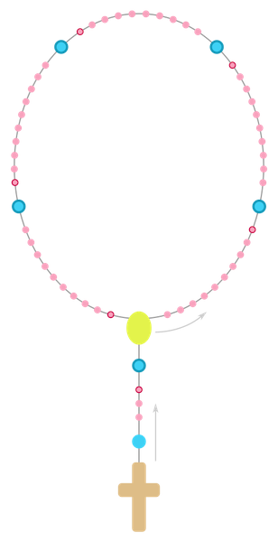

# How to Pray the Rosary

## Basic structure

  

Starting with the Crucifix:

- Make the Sign of the Cross.
- Holding the Crucifix in your hand, say the Apostles' Creed.
- Say the Our Father at the first large bead.
- Say the Hail Mary on each of the next three beads.
- Say the Glory Be in the space before the next large bead.
   - After the Glory Be, some say the following prayer requested by the Blessed Virgin Mary at Fatima: O my Jesus, forgive us our sins, save us from the fires of hell; lead all souls to Heaven, especially those who have most need of Thy mercy.  

- At the large bead, announce the first mystery (e.g. "The First Glorious Mystery is the Resurrection").  
      - You may want to pause and meditate on the mystery for a moment. 
- Say the Our Father.
- Move to the first decade of small beads, and say the Hail Mary once per bead. 
- Say the Glory Be on the space before the next large bead.  
- At the next large bead, announce the next mystery.
- Say the Our Father. 
- Continue through the Rosary until you complete all five mysteries and the ten Hail Marys for each mystery. 

### To conclude:

- Say the Hail Holy Queen (while holding the medal that connects the string with the Crucifix to the loop).
- Say the Closing Prayer to end the Rosary.
- Make the Sign of the Cross.

---
*Image Credit: Schematic representation of the Catholic Rosary. Made and uploaded to Wikimedia Commons by Huhsunqu. (2006-02-11). This file is licensed under the [Creative Commons Attribution-Share Alike 2.5 Generic license](https://creativecommons.org/licenses/by-sa/2.5/deed.en).*

