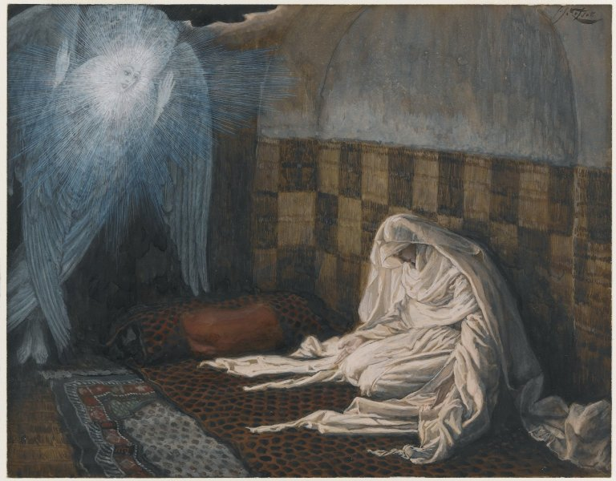

# The First Joyful Mystery

The First Joyful Mystery is the Annunciation.  

> And in the sixth month, the angel Gabriel was sent from God into a city of Galilee, called Nazareth, To a virgin espoused to a man whose name was Joseph, of the house of David; and the virgin's name was Mary. And the angel being come in, said unto her: Hail, full of grace, the Lord is with thee: blessed art thou among women.  

*Luke 1:26-28 (Douay-Rheims Bible)*

Fruit of the mystery: **Humility**

*James Tissot (Nantes, France, 1836–1902, Chenecey–Buillon, France). The Annunciation (L'annonciation), 1886–1894.*
