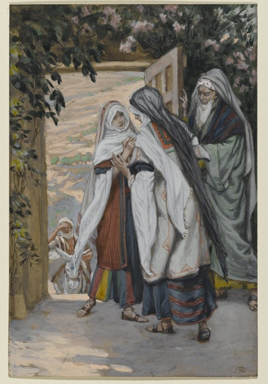

# The Second Joyful Mystery

The Second Joyful Mystery is the Visitation. 

*Luke 1:39-42*
> And Mary rising up in those days, went into the hill country with haste into a city of Juda.  And she entered into the house of Zachary, and saluted Elizabeth.
> 
>And it came to pass, that when Elizabeth heard the salutation of Mary, the infant leaped in her womb. And Elizabeth was filled with the Holy Ghost:  And she cried out with a loud voice, and said: Blessed art thou among women, and blessed is the fruit of thy womb.

Fruit of the mystery: **Love of Neighbor**

*James Tissot. The Visitation (La visitation), 1886–1894.*