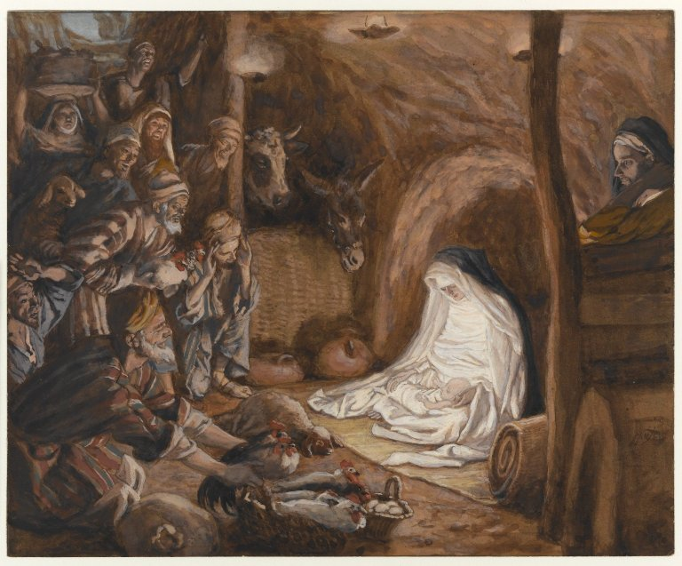

# The Third Joyful Mystery

The Third Joyful Mystery is the Nativity.

*Luke 2:1-7*
>And it came to pass, that in those days there went out a decree from Caesar Augustus, that the whole world should be enrolled. This enrolling was first made by Cyrinus, the governor of Syria. And all went to be enrolled, every one into his own city. And Joseph also went up from Galilee, out of the city of Nazareth into Judea, to the city of David, which is called Bethlehem: because he was of the house and family of David, To be enrolled with Mary his espoused wife, who was with child.
> 
>And it came to pass, that when they were there, her days were accomplished, that she should be delivered. And she brought forth her firstborn son, and wrapped him up in swaddling clothes, and laid him in a manger; because there was no room for them in the inn.

Fruit of the mystery: **Poverty**

*James Tissot. The Adoration of the Shepherds (L'adoration des bergers), 1886–1894.*
