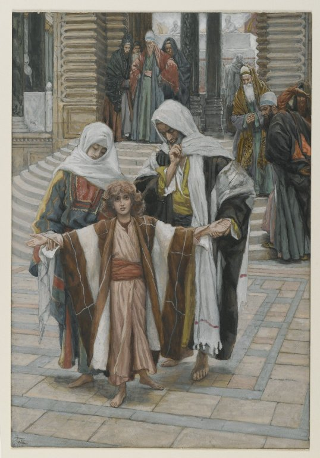

# The Fifth Joyful Mystery

The Fifth Joyful Mystery is the Finding in the Temple.  

*Luke 2:41-47*
>And his parents went every year to Jerusalem, at the solemn day of the pasch,  
> 
>And when he was twelve years old, they going up into Jerusalem, according to the custom of the feast,  
>  
>And having fulfilled the days, when they returned, the child Jesus remained in Jerusalem; and his parents knew it not.  
> 
>And thinking that he was in the company, they came a day's journey, and sought him among their kinsfolks and acquaintance.  
>  
>And not finding him, they returned into Jerusalem, seeking him.  
> 
>And it came to pass, that, after three days, they found him in the temple, sitting in the midst of the doctors, hearing them, and asking them questions. 
>  
>And all that heard him were astonished at his wisdom and his answers. 

Fruit of the mystery: **Devotion to Jesus**

*James Tissot. Jesus Found in the Temple (Jesus retrouvé dans le temple), 1886–1894.*
