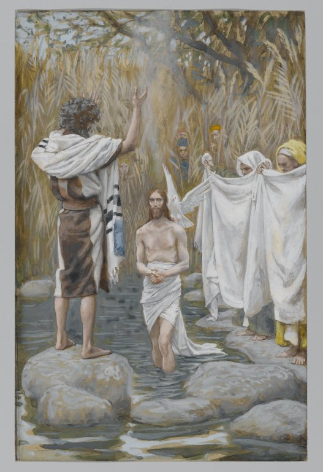

# The First Luminous Mystery

The First Luminous Mystery is the Baptism of Christ in the Jordan.

*Matthew 3:16-17*
> And Jesus being baptized, forthwith came out of the water: and lo, the heavens were opened to him: and he saw the Spirit of God descending as a dove, and coming upon him. And behold a voice from heaven, saying: This is my beloved Son, in whom I am well pleased.

Fruit of the mystery: **Openness to the Holy Spirit**

*James Tissot (Nantes, France, 1836–1902, Chenecey–Buillon, France). The Baptism of Jesus (Baptême de Jésus), 1886–1894.* 
