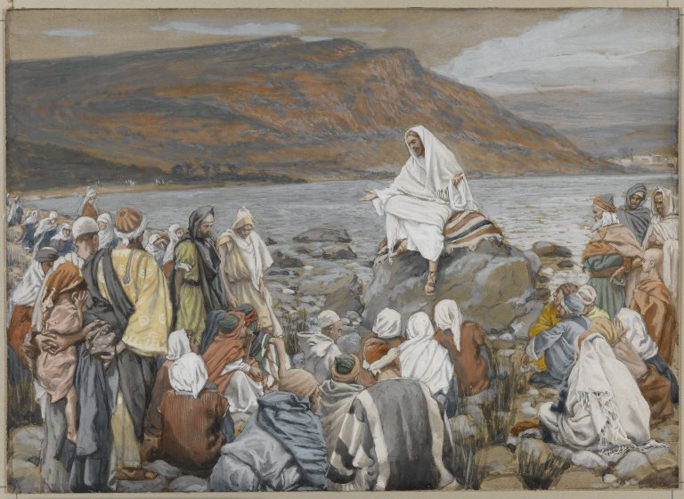

# The Third Luminous Mystery

The Third Luminous Mystery is Jesus' Proclamation of the Coming of the Kingdom of God.

>And after that John was delivered up, Jesus came into Galilee, preaching the gospel of the kingdom of God,
> 
> And saying: The time is accomplished, and the kingdom of God is at hand: repent, and believe the gospel.

*Mark 1:14-15 (Douay-Rheims Bible)*

Fruit of the mystery: **Conversion**

*James Tissot. Jesus Teaches the People by the Sea (Jésus enseigne le peuple près de la mer), 1886–1896.*