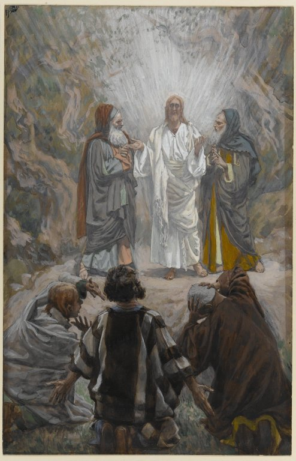

# The Fourth Luminous Mystery

The Fourth Luminous Mystery is the Transfiguration. 

> And after six days Jesus taketh unto him Peter and James, and John his brother, and bringeth them up into a high mountain apart: And he was transfigured before them. And his face did shine as the sun: and his garments became white as snow. And behold there appeared to them Moses and Elias talking with him.

*Matthew 17:1-3 (Douay-Rheims Bible)*

Fruit of the mystery: **Desire for holiness**

*James Tissot. The Transfiguration (La transfiguration), 1886–1896.*
