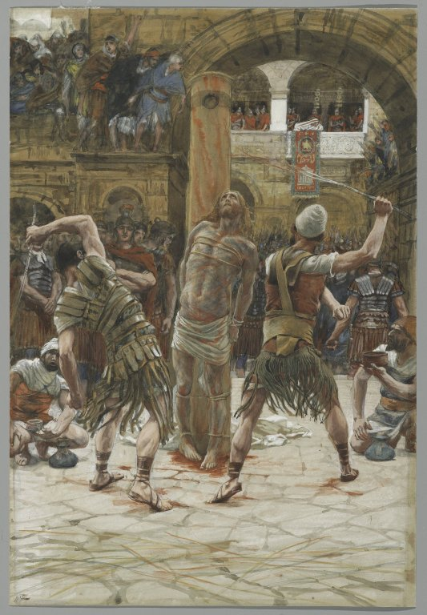

# The Second Sorrowful Mystery

The Second Sorrowful Mystery is the Scourging at the Pillar.

*Matthew 27:26*
> Then he released to them Barabbas, and having scourged Jesus, delivered him unto them to be crucified.

Fruit of the mystery: **Mortification**

*James Tissot. The Scourging on the Front (La flagellation de face), 1886–1894.*
