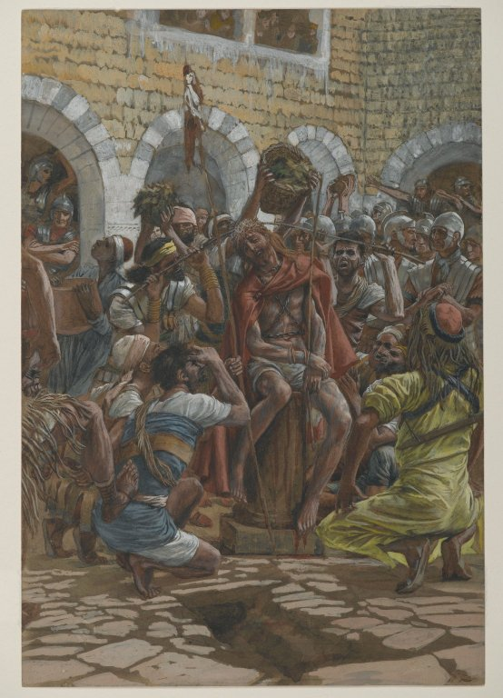

# The Third Sorrowful Mystery

The Third Sorrowful Mystery is the Crowning with Thorns.

> Then the soldiers of the governor taking Jesus into the hall, gathered together unto him the whole band; And stripping him, they put a scarlet cloak about him. And platting a crown of thorns, they put it upon his head, and a reed in his right hand. And bowing the knee before him, they mocked him, saying: Hail, king of the Jews.

*Matthew 27:27-29 (Douay-Rheims Bible)*

Fruit of the mystery: **Courage**

*James Tissot. The Crowning of Thorns (Le couronnement d'épines), 1886–1894.*
