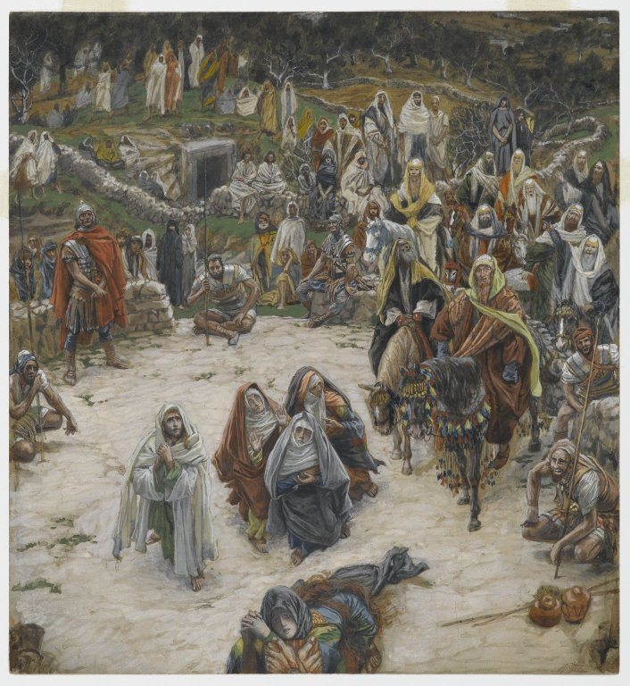

# The Fifth Sorrowful Mystery

The Fifth Sorrowful Mystery is the Crucifixion.

*Luke 23:45-47*
> And the sun was darkened, and the veil of the temple was rent in the midst. And Jesus crying out with a loud voice, said: Father, into thy hands I commend my spirit. And saying this, he gave up the ghost. Now the centurion, seeing what was done, glorified God, saying: Indeed this was a just man.

Fruit of the mystery: **Sorrow for our Sins**

*James Tissot. What Our Lord Saw from the Cross (Ce que voyait Notre-Seigneur sur la Croix), 1886–1894.*
